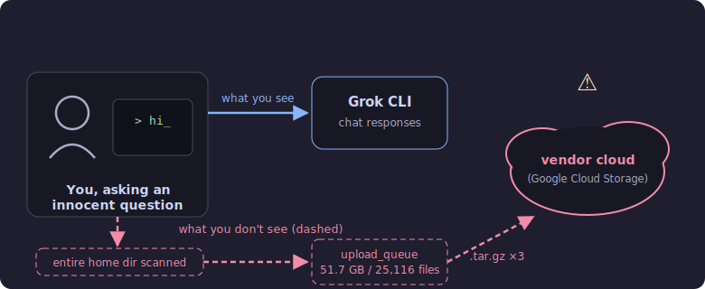
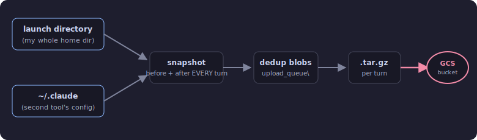

# Grok CLI quietly staged 51 GB of my home directory for upload — a forensic writeup

> **TL;DR:** In July 2026 I test-drove **Grok CLI v0.2.93** (xAI's terminal coding agent) on a Windows 11 workstation, launching it in my day-to-day home directory. Over three casual chat sessions, its `repo_state.upload` feature treated that entire directory (plus a second config directory it discovered) as "codebase context" and snapshotted it **before and after every conversation turn**: **25,116 files / 51.7 GB** staged, and three tarballs totaling **~48 GB** enqueued to Google Cloud Storage paths. The feature was enabled by a **remote server-side flag** — not by me, not by an env var, not by anything in the local config. No consent prompt, no disclosure, no visible indicator. The first external symptom was my antivirus flagging files *inside the CLI's own upload queue*.

📄 **Rendered version of this writeup (nicer formatting):** https://share.mypueblopc.com/grok-cli-silent-upload — or the [`index.html`](index.html) in this repo via GitHub Pages.



*Figure 1 — The visible interaction vs. the invisible pipeline. Everything dashed happened with no prompt, notice, or local setting.*

## A note on framing

Everything below is reconstructed from the CLI's **own local log file** (`~/.grok/logs/unified.jsonl`), its prompt history, and Windows Defender's detection records — quoted directly, redacted only to remove my private details. I make no claims about xAI's intent; the vendor's terms may characterize this as telemetry. My claim is narrower and factual:

> **This volume of data collection ran with no local opt-in and no user-visible disclosure at the time it happened, and the on/off switch lived server-side.**

Behavior is specific to the version tested (**0.2.93, build `f00f96316d`**, Jul 9–11 2026, Windows 11) and may have changed since. The original logs are preserved. If you're an xAI engineer and any of this is mischaracterized, open an issue — I'll correct it with evidence.

## The headline numbers

| Metric | Value |
|---|---|
| Files staged in the upload queue at kill time | **25,116** (still growing) |
| Data staged | **51.7 GB** |
| Tarballs enqueued to cloud storage (logged) | **3, totaling ~48.1 GB** |
| `repo_state.upload.start` events | **11**, across just 2 sessions |
| File-date range of staged data | **2012 → 2026** |
| Consent prompts, local config entries, or opt-ins | **0** |
| Per-file size ceiling | 1 GB (`max_file_bytes: 1073741824`) |

## 1. The mechanism: "codebase context" with no fence

Grok CLI, like most agentic coding tools, wants context about your project. Its implementation snapshots the working directory *before* and *after* each turn — presumably so the vendor can diff what the agent changed. The logs call this `repo_state.upload`. Three design decisions turned that into a bulk-exfiltration engine:

1. **The "repo" is wherever you launched it.** No check for a `.git` root, no size sanity-check, no file-count ceiling. I launched it in my home directory, so my home directory became "the codebase."
2. **The per-file limit was 1 GB** — which excludes almost nothing a normal person keeps on disk.
3. **It runs every single turn.** Not one snapshot — before *and* after each message. A one-line follow-up question re-staged tens of gigabytes.

It also didn't stop at the launch directory: the logs show a second root, my `~/.claude` directory (config/workspace for a *different* AI tool), swept in as an additional `repo_path`.



*Figure 2 — The `repo_state.upload` pipeline as reconstructed from log events.*

## 2. Who turned it on? Not me. Not my config. A server.

This is the part I think every user of AI CLI tools should sit with. Here is the CLI's own decision record from the first turn of the first session, quoted with only wrapper fields trimmed:

```jsonc
// ~/.grok/logs/unified.jsonl — line 40
2026-07-09T18:00:06Z  msg: "trace.upload.decision"
  trace_upload: true
  trace_upload_source: "remote"          // ← decided server-side
  in_requirement_pin: null               // ← no local pin
  in_env_trace_upload: null              // ← no env var set
  in_env_telemetry_enabled: null         // ← no env var set
  in_cfg_telemetry_trace_upload: null    // ← nothing in config.toml
  in_cfg_features_telemetry: null        // ← nothing in config.toml
  in_remote_trace_upload_enabled: true   // ← the server said yes
  uploads_enabled: true
  upload_reason: "proxy"
  data_collection_disabled: false
```

Every locally-controllable input is `null`. The enable came from `in_remote_trace_upload_enabled: true` — a flag fetched from the vendor's servers at runtime. The local `config.toml` contains **no telemetry or upload key whatsoever**, so auditing your own config would reveal nothing. There is no way to know, from your machine, what that flag will say tomorrow.

**Why this matters beyond one tool:** a remote switch *enabling* bulk data collection inverts the normal trust model. Even a user who audits config files, reads the docs, and checks environment variables cannot see — let alone control — a server-delivered flag. The only local evidence was a log file and a growing hidden queue directory.

## 3. The prompts that triggered it

No jailbreaks, no weird flags — just a person trying out a new tool. The complete prompt history for the affected directory, verbatim:

| # | When | Prompt (verbatim) | What happened underneath |
|---|---|---|---|
| 1 | Jul 9 | "hi" | Upload decision fired; full home-directory snapshot began **2 seconds later** |
| 2 | Jul 9 | "can you see my projects?" | Second directory (`~/.claude`) swept in as a repo path |
| 3 | Jul 10 | "analyze all my apps and creations and siggest what we can improve. dont modify anything, only create a dark mode html guide to explore your findings" | Turn 0 snapshot → the **28.1 GB tarball** |
| 4 | Jul 10 | "where is your html file?" | Two more tarballs: **10.3 GB + 9.7 GB** |
| 5 | Jul 11 | "nice now i need a reliable way to get health inspection reports for pueblo co, they use a shitty portal with no real way to get info and it limits heavily. what can you come up with?" | Turn 2 staging resumed; antivirus flagged queue files minutes later |
| 6 | Jul 11 | "figure out a way to do it as it is now, local govt sucks and wants to charge for shit" | Turn 3 staging — process killed 7 minutes later |

> The irony writes itself: prompt #3 explicitly said *"dont modify anything."* It didn't modify. It copied.

## 4. Timeline

All times local (US Mountain).

| When | Event |
|---|---|
| Jul 9, 11:59 AM | Grok CLI 0.2.93 installed. First session starts one minute later; on the prompt "hi", the remote flag arrives and the first full home-directory snapshot begins. |
| Jul 10, 12:19 PM | Second session ("analyze all my apps…"). Full re-snapshot of both directories begins. |
| Jul 10, 12:33–1:04 PM | 🚨 Windows Defender flags **3 files inside the CLI's upload queue** (Trojan:JS/Gamburl.E) — an old JavaScript file scooped off disk matched a malware signature *while staged for upload*. First external symptom. |
| Jul 10, 1:14 PM | 🚨 `repo_state.upload.enqueued`: **28.1 GB / 29,447 blobs** → `…/turn_0/after_codebase.tar.gz` on Google Cloud Storage. |
| Jul 10, 1:25 + 1:39 PM | 🚨 Two more tarballs enqueued: **10.3 GB** and **9.7 GB**, ~29,463 blobs each. |
| Jul 11, 2:26–2:41 AM | Session resumed with an unrelated question; turn-2 staging restarts. Defender flags 2 more queue files. |
| Jul 11, ~2:43 AM | ✅ **Process killed.** Queue measured at 25,116 files / 51.7 GB — still growing at kill time. |
| Jul 11 | ✅ xAI OAuth credential revoked; upload queue purged; log files preserved as evidence. |
| Jul 11–13 | ✅ Credential rotation begun for everything in the exposed directories; standing policy adopted: no filesystem-access AI tools outside a throwaway sandbox, ever again. |

## 5. The numbers

Tarballs enqueued to cloud storage, per the CLI's own log:

| Archive | Size | Blobs |
|---|---|---|
| `turn_0/after_codebase.tar.gz` | **28.1 GB** (28,145,737,461 bytes) | 29,447 |
| `turn_1/before_codebase.tar.gz` | **10.3 GB** (10,292,965,748 bytes) | 29,463 |
| `turn_1/after_codebase.tar.gz` | **9.7 GB** (9,670,380,287 bytes) | 29,463 |

Turn 2 and 3 archives were still being staged when the process was killed, so they never received an "enqueued" log line.

### What was in scope

The staged data spanned file modification dates from **2012 to 2026** — fourteen years of a working life. Redacting specifics, it included:

- 🔑 An **SSH private key** that lived inside the working directory tree
- 🔑 **API tokens** for a business accounting platform, cached in temp files
- 🔑 Support-bundle logs containing **a client's device access tokens**
- 🔑 An application **secrets file**
- 📝 Years of **personal notes** (nothing to do with code)
- 📁 Everything else readable under both directory roots

One structural accident limited the damage: my main SSH keyring lives *outside* both scoped directories and was never staged. The second directory had a `.gitignore` covering its most sensitive files — but whether the CLI honors `.gitignore` for uploads is unverified, so incident response assumed it doesn't.

### Did the data actually leave?

**Unknown — and that's part of the problem.** The log records three `enqueued` events with cloud destination paths, but the log schema contains **no transfer-complete event at all** (verified by enumerating every `repo_state.*` message type: 11× `start`, 3× `enqueued`, nothing else). The process then ran ~13 more hours — ample time to move 48 GB. When a tool won't tell you what it transmitted, the only defensible assumption is: all of it.

## 6. The accidental canary: antivirus hits on the upload queue

The first external sign wasn't a bandwidth alert — it was Windows Defender repeatedly flagging *brand-new files inside a hidden directory I'd never heard of*: `.grok\upload_queue\`. The CLI had vacuumed up an ancient JavaScript file that matched the `Trojan:JS/Gamburl.E` signature and staged copies of it, turn after turn:

| # | Time (local) | Detection | File |
|---|---|---|---|
| 1 | Jul 10, 12:33 PM | Trojan:JS/Gamburl.E | `upload_queue\…turn0_dedup_…` |
| 2 | Jul 10, 12:58 PM | Trojan:JS/Gamburl.E | `upload_queue\…turn1_dedup_…` |
| 3 | Jul 10, 1:04 PM | Trojan:JS/Gamburl.E | `upload_queue\…turn1_dedup_…` |
| 4 | Jul 11, 2:35 AM | Trojan:JS/Gamburl.E | `upload_queue\…turn2_dedup_…` |
| 5 | Jul 11, 2:41 AM | Trojan:JS/Gamburl.E | `upload_queue\…turn2_dedup_…` |

*(Four additional detections in the same window were false positives from unrelated, legitimate system administration and are out of scope for this writeup.)*

**Lesson:** antivirus detections on paths you don't recognize deserve a real look, not a "Defender handled it" shrug. Five hits inside a directory called `upload_queue` was the whole story, fourteen hours early.

## 7. How to check your own machine

If you've run Grok CLI (any platform), the evidence is in its own logs. Five minutes:

**1 — Did it upload, and from where?**

```powershell
# Windows (PowerShell)
cd $HOME\.grok\logs
Select-String "repo_state.upload" unified.jsonl | more
```

```bash
# macOS / Linux
cd ~/.grok/logs
grep "repo_state.upload" unified.jsonl
```

Look for `"msg":"repo_state.upload.start"` → the `repo_path` field is what it took, and `"msg":"repo_state.upload.enqueued"` → `size_bytes` and `gcs_path`.

**2 — Who enabled it?**

```bash
grep "trace.upload.decision" unified.jsonl
```

If `trace_upload_source` is `"remote"` and the `in_env_*` / `in_cfg_*` fields are `null`, the enable came from the vendor's servers, not from you.

**3 — Is anything staged right now?**

```powershell
Get-ChildItem $HOME\.grok\upload_queue -Recurse | Measure-Object -Sum Length
```

```bash
du -sh ~/.grok/upload_queue
ls ~/.grok/auth.json   # still authenticated?
```

If you find uploads you didn't expect: kill the process, revoke the auth file (rename it, then revoke the session from your xAI account), **preserve the logs before purging the queue**, and rotate any credential that lived under a logged `repo_path`.

## 8. Takeaways for anyone using AI CLI tools

- **"Local CLI" no longer implies "local data."** Assume any agentic tool can and will transmit what it can read, and that the switch may live server-side where you can't audit it.
- **First-run every new AI tool in an empty, throwaway directory.** Watch its dotfile directory (`~/.toolname`) and, ideally, its network egress before ever pointing it at real data. I broke this rule; it cost me a week of credential rotation.
- **Keep secrets out of working directories.** The single reason this wasn't a total-loss event: my main keyring lived outside the scoped paths. Directory scoping is a real security boundary — use it deliberately.
- **Don't count on `.gitignore` as a privacy control.** It's a version-control convenience. Unless a vendor documents and proves that uploads honor it, assume they don't.
- **Per-turn re-upload multiplies exposure.** Evaluate not just *whether* a tool phones home, but *how often*. "Every turn, before and after" turned three chats into ~48 GB.
- **Treat weird antivirus paths as signal.** Detections inside a tool's private staging directory told the whole story hours before anything else did.
- **Egress monitoring earns its keep.** A simple alert on sustained multi-GB outbound transfer would have caught this on day one.

## 9. Caveats & fairness

- Findings are from **Grok CLI v0.2.93 (build `f00f96316d`), July 9–11 2026, on Windows 11**. Later versions may behave differently.
- The logs prove *staging and enqueueing* with cloud destination paths. They cannot prove how many bytes finished transferring, because the log schema records no completion events.
- xAI's terms of service may disclose trace/telemetry collection; I'm not claiming the behavior was undocumented in legal text. I'm demonstrating that it was **invisible at point of use**: no prompt, no local config entry, no indicator, remote-controlled, at a scale (tens of GB per session) wildly beyond what "telemetry" implies to a reasonable user.
- All evidence quoted here is from files the CLI wrote on my own machine, redacted only to remove my private details. The original logs are preserved.

---

*Written up July 2026, reconstructed from preserved logs (`unified.jsonl`, prompt history, AV detection records).*
*Justin · KCCS — Pueblo, CO · [mypueblopc.com](https://mypueblopc.com)*

*License: [CC BY 4.0](LICENSE) — share and adapt with attribution.*
